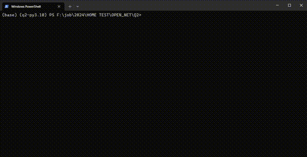

## Description
A demo of Python RabbitMQ

## Connect setting
Modify config.ini
```
[General]
rebitmq_host = localhost
rebitmq_port = 5672
rebitmq_username = guest
rebitmq_password = guest
queue_name = test_queue
```

## Installing

### From Source
1. Install poetry:
```sh
pip install poetry
```

2. Install dependencies:
```sh
poetry install
```

3. Run:
```sh
poetry run python main.py
```

### Using docker

1. Build the docker image and create docker container:
```sh
docker compose up -d
```

## Demo
